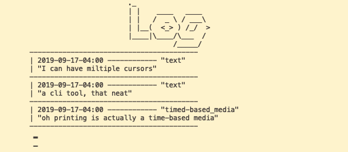

## Deep Work

*This section presents explorations and thoughts relating to deep work*.

**Hamming** - *The Art and Science of Engineering* 

> In a lifetime of many, many independent choices, small and large, a career with a vision will get you a distance proportional to n, while no vision will get you only the distance In a sense, the main difference between those who go far and those who do not is some people have a vision and the others do not and therefore can only react to the
current events as they happen.

**Goetz Bachmann** - *Terms of Media*

> The idea that media has to become more effective at bringing, quote, "thought outside of the body" so that we can use such external imagination to play with them, to communicate them, to interact with them, instead of being stuck with thought in an already overcrowded brain. And this overcrowded is so often being described to me, this problem of having this overcrowded brain, especially when you program. As banal is here, media for the lab are indeed truly tertiary retentions. And the longer you dream all day long about these tertiary attentions yet to be invented, talk is indeed a sad, painful, ineffective, hurtful form of communication.

**Jonathan Blow** - *Deep Work*

> Deep work changes you so if you do deep work in any of these areas you are a different person at the end than you were at the beginning and you're better at what you do in a substantial way not just an incremental way but a way that is different in character another characteristic though aside from the fact that it changes you is that when you start out you don't know where you're going

> demanding them to happen on time makes them not happen I don't want to put

> one of the best things I can do for generating new ideas is to clear out the old ones. Force my way through make enough time that I'm just gonna go through that old list and try everything I was uncertain about decide yes or no am I really gonna try all these vague ideas and thoughts that are lined up and just crank through them and always as soon as I'm done cranking through those a new period of creativity starts

> How to destroy deep work:

> Scheduling
> Childproofing
> Chasing Success / Team Politics

 **Cezanne** 

 >Yes, a bunch of carrots, observed directly, painted simply in the personal way one sees it, worth more than the Ecole’s everlasting slices of buttered bread, that tabasco-juice paining, slavishly done by the book? The day is coming when a single original carrot will give birth to a revolution.

**Paul Graham** - *The Top Idea in Your Mind*

>Everyone who's worked on difficult problems is probably familiar with the phenomenon of working hard to figure something out, failing, and then suddenly seeing the answer a bit later while doing something else. There's a kind of thinking you do without trying to. I'm increasingly convinced this type of thinking is not merely helpful in solving hard problems, but necessary. The tricky part is, you can only control it indirectly. 

>I think most people have one top idea in their mind at any given time. That's the idea their thoughts will drift toward when they're allowed to drift freely. And this idea will thus tend to get all the benefit of that type of thinking, while others are starved of it. Which means it's a disaster to let the wrong idea become the top one in your mind.

**Dali** - on the slumber with a key method in *50 Secrets of Magic Craftmanship*

> The moment the key drops from your fingers, you may be sure that the noise of its fall on the upside-down plate will awaken you, and you may be equally sure that this fugitive moment when you had barely lost consciousness and during which you cannot be assured of having really slept is totally sufficient, inasmuch as not a second more is needed for your physical and psychic being to be revivified by just the necessary amount of repose.

**Farīd ud-Dīn ʿAṭṭār** *The Conference of the Birds*

> Be occupied as little as possible with things of the outer world but much with things of the inner world; then right action will overcome inaction.

**Various** *Remember Manual*

> If Emacs could become a more intelligent data store, where brainstorming would focus on the ideas involved—rather than the structuring and format of those ideas, or having to stop your current flow of work in order to record them—it would map much more closely to how the mind (well, at least mine) works, and hence would eliminate that very manual-ness which computers from the very beginning have been championed as being able to reduce.

___

*In Danish, when you cannot stop listening to a song in your head we call it "to have a song on the brain". I want to explore what tools could generate documentation of the process of having things on your brain.*

#### Chasmic - a tool for documenting ideas

I have been really inspired by people who made their own time-tracking tools for a while. The first system which inspired my was Devine Lu Linvega's [xxiivv](https://wiki.xxiivv.com/#about) project. This monday I stumbled upon Blinry's [habitctl](https://github.com/blinry/habitctl) project.

Blinry's project is written in Rust and seeing how straigtforward it can be I decided to make my own little CLI time-tracker: Chasmic.

I ended up creating a simple system which makes it possible for me to keep a list of the ideas which are currently on top of my head and a log system which makes it possible for me to log thoughts I have about certain ideas.

This system works decently well. I even made an ambient visualisation of the amount of log statements per topic over time (the lines in the bottom of the photo above).

Whereas I like the tool as the product of an exploration, I don't think I will use it to actually keep track of my ideas. Mostly because I don't have a vision for how I want to work with the ideas that I document.

Just when I finished my tool I got into a conversation with [Ryan](https://ryanprior.com) who suggested that I look at org-mode (commonly used as part of Emacs) for inspiration. This turned out to be a wonderful suggestion. Thank you Ryan!

#### Org-mode!

Org-mode is a powerful environment for working with ideas, and for organising your projects.

When I heard of it I became incredibly excited and luckily there were many people who were willing to teach me a bit about how to use emacs and org-mode.

After two days of learning and exploration I am starting to organise my life with org-mode. At the moment I mostly use the standard formatting together with the agenda and the capture interface.

A little sneak peak of my .org file

